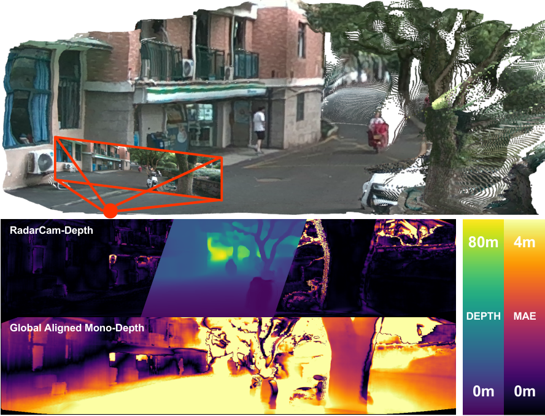
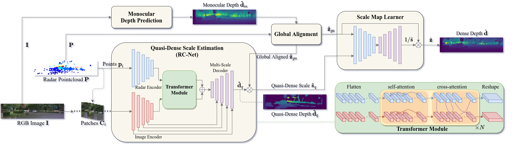

# RadarCam-Depth

RadarCam-Depth: Radar-Camera Fusion for Depth Estimation with Learned Metric Scale (ICRA2024)

## Introduction



**Abstract:** We present a novel approach for metric dense depth estimation based on the fusion of a single-view image and a sparse, noisy Radar point cloud. The direct fusion of heterogeneous Radar and image data, or their encodings, tends to yield dense depth maps with significant artifacts, blurred boundaries, and suboptimal accuracy. To circumvent this issue, we learn to augment versatile and robust monocular depth prediction with the dense metric scale induced from sparse and noisy Radar data. We propose a Radar-Camera framework for highly accurate and fine-detailed dense depth estimation with four stages, including monocular depth prediction, global scale alignment of monocular depth with sparse Radar points, quasi-dense scale estimation through learning the association between Radar points and image patches, and local scale refinement of dense depth using a scale map learner. Our proposed method significantly outperforms the state-of-the-art Radar-Camera depth estimation methods by reducing the mean absolute error (MAE) of depth estimation by 25.6% and 40.2% on the challenging nuScenes dataset and our self-collected ZJU-4DRadarCam dataset, respectively.




Our proposed RadarCam-Depth is comprised with four stages: **monocular depth prediction**, **global alignment of mono-depth** with sparse Radar depth, learned **quasi-dense scale estimation**, and **scale map learner** for refining local scale. $\mathbf{d}$ and $\mathbf{s}$ denotes the depth and scale, while $\mathbf{z}=1/\mathbf{d}$ is the inverse depth.

## Demo

https://youtu.be/JDn0Sua5d9o

## Dataset

Download link (Baidu): [ZJU-4DRadarCam](https://pan.baidu.com/s/1owUFYBisYJGkibHPRhkntg?pwd=1897)
Download link (APRIL LAB): [ZJU-4DRadarCam](http://gofile.me/5oQXF/05sbsVCsB) UPLOADING
Code for extracting netdisk data if needed: 1897

```
ZJU-4DRadarCam
├── data
│   ├── gt  # sparse lidar depths
│   ├── gt_interp  # interpolated lidar depths
│   ├── image # RGB images
│   ├── radar # npy files of radar depths
│   ├── radar_png # png files of radar depths
│   ├── train.txt # files for training
│   ├── val.txt # files for validation
│   ├── test.txt # files for testing
│   ├── full.txt # full files
├── result
│   ├── global_aligned_mono
│   │   ├── dpt_var # global aligned DPT predictions
│   ├── rcnet
│   │   ├── depth_predicted # quasi-dense depth from RC-Net
```

## Usage

Setup dependencies:

```
conda env create -f environment.yaml
conda activate rc-depth
```

Download [ZJU-4DRadarCam](https://pan.baidu.com/s/1owUFYBisYJGkibHPRhkntg?pwd=1897) and use `sml_run_zju.py` for quick starting.

### Monocular Predictions
DPT:
https://github.com/isl-org/DPT

MiDaS:
https://github.com/isl-org/MiDaS

### RC-Net
For intermediate output (quasi-dense depth):

```
python rcnet_train_zju.py
python rcnet_run_zju.py
```

### Scale Map Learner
For final dense depth:

```
python sml_train_zju.py
python sml_run_zju.py
```

## Citation

```
@article{li2024radarcam,
  title={RadarCam-Depth: Radar-Camera Fusion for Depth Estimation with Learned Metric Scale},
  author={Li, Han and Ma, Yukai and Gu, Yaqing and Hu, Kewei and Liu, Yong and Zuo, Xingxing},
  journal={arXiv preprint arXiv:2401.04325},
  year={2024}
}
```

## Acknowledgements

Our work builds on and uses code from [DPT](https://github.com/isl-org/DPT), [MiDaS](https://github.com/isl-org/MiDaS), [VI-Depth](https://github.com/isl-org/VI-Depth), and [radar-camera-fusion-depth](https://github.com/nesl/radar-camera-fusion-depth). We'd like to thank the authors for making these libraries and frameworks available.

